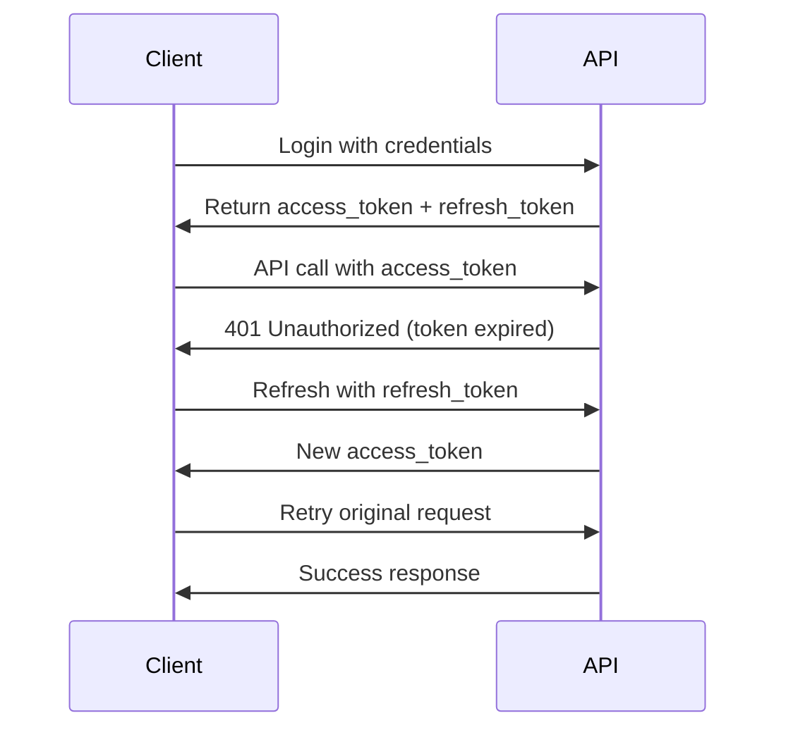
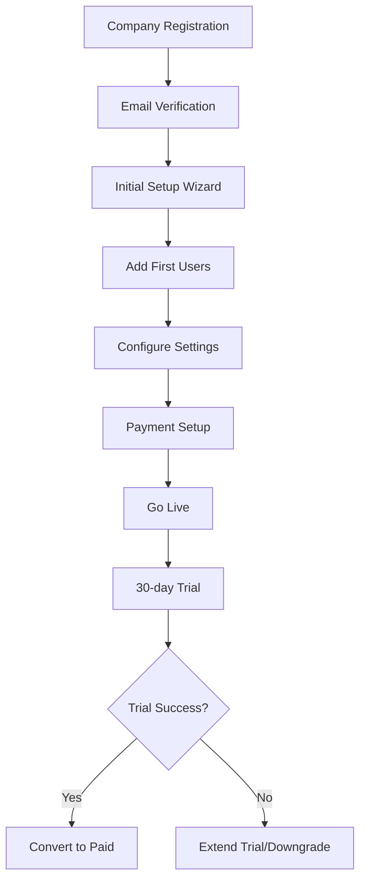

# 📚 Custom Markdown Examples

This document provides complete, real-world examples of using the custom markdown functionality in APIDoc 4.0.5.

## 🎯 Complete Working Example

### Project Structure
```
my-api-project/
├── src/
│   ├── controllers/
│   │   ├── users.js
│   │   ├── auth.js
│   │   ├── company.js
│   │   └── analytics.js
│   └── models/
├── docs/
│   ├── users.md
│   ├── auth.md
│   ├── company.md
│   └── analytics.md
├── apidoc.json
├── package.json
└── output/
```

### Configuration File

**`apidoc.json`**
```json
{
  "name": "E-Commerce API Documentation",
  "version": "2.1.0",
  "description": "Comprehensive API documentation for our e-commerce platform",
  "title": "E-Commerce API v2.1",
  "url": "https://api.ecommerce.com",
  "sampleUrl": "https://api.ecommerce.com",
  "header": {
    "title": "Getting Started",
    "filename": "header.md",
    "icon": "fa-home"
  },
  "footer": {
    "title": "Support & Contact",
    "filename": "footer.md",
    "icon": "fa-support"
  },
  "order": [
    "Authentication",
    "Users",
    "Company",
    "Analytics"
  ],
  "settings": {
    "Authentication": {
      "icon": "fa-shield-alt",
      "title": "Authentication & Security",
      "filename": "docs/auth.md"
    },
    "Users": {
      "icon": "fa-users",
      "title": "User Management",
      "filename": "docs/users.md"
    },
    "Company": {
      "icon": "fa-building",
      "title": "Company Operations",
      "filename": "docs/company.md"
    },
    "Analytics": {
      "icon": "fa-chart-line",
      "title": "Analytics & Reports",
      "filename": "docs/analytics.md"
    }
  },
  "logo": {
    "icon": "fa-shopping-cart",
    "alt": "E-Commerce API"
  }
}
```

### Markdown Content Files

**`docs/auth.md`**
```markdown
## 🔐 Authentication & Security

Our API uses **JWT (JSON Web Tokens)** for secure authentication with support for OAuth2 providers.

### 🚀 Quick Start Authentication

1. **Obtain Token**: Exchange credentials for JWT
2. **Include in Headers**: Add `Authorization: Bearer <token>` to requests
3. **Refresh When Needed**: Use refresh token for long sessions

### 🔑 Authentication Methods

| Method | Use Case | Token Lifetime |
|--------|----------|----------------|
| **Username/Password** | Direct login | 15 minutes |
| **OAuth2 Google** | Social login | 1 hour |
| **OAuth2 GitHub** | Developer accounts | 1 hour |
| **API Key** | Server-to-server | No expiration |

### 🛡️ Security Best Practices

> ⚠️ **CRITICAL SECURITY REQUIREMENTS**

- ✅ **Always use HTTPS** in production environments
- ✅ **Store tokens securely** (httpOnly cookies recommended)
- ✅ **Validate tokens** on every request
- ✅ **Implement rate limiting** to prevent abuse
- ❌ **Never expose tokens** in client-side JavaScript
- ❌ **Don't store tokens** in localStorage for sensitive data

### 📋 Token Structure

Our JWT tokens include these standard claims:

```json
{
  "sub": "user_12345",
  "email": "john.doe@company.com",
  "role": "admin",
  "permissions": ["read", "write", "delete"],
  "company_id": "comp_67890",
  "iat": 1640995200,
  "exp": 1640998800,
  "iss": "api.ecommerce.com"
}
```

### 🔄 Token Refresh Flow



### 🚨 Error Responses

Authentication errors return standardized responses:

```json
{
  "success": false,
  "error": {
    "code": "INVALID_TOKEN",
    "message": "Access token has expired",
    "details": {
      "expired_at": "2024-01-15T10:30:00Z",
      "action": "refresh_token_required"
    }
  },
  "request_id": "req_abc123"
}
```

### 📱 Client Implementation Examples

#### JavaScript/Node.js
```javascript
class APIClient {
  constructor(baseURL) {
    this.baseURL = baseURL;
    this.accessToken = null;
    this.refreshToken = null;
  }

  async login(email, password) {
    const response = await fetch(`${this.baseURL}/auth/login`, {
      method: 'POST',
      headers: { 'Content-Type': 'application/json' },
      body: JSON.stringify({ email, password })
    });

    const data = await response.json();
    this.accessToken = data.access_token;
    this.refreshToken = data.refresh_token;
    return data;
  }

  async makeAuthenticatedRequest(endpoint, options = {}) {
    const headers = {
      'Authorization': `Bearer ${this.accessToken}`,
      'Content-Type': 'application/json',
      ...options.headers
    };

    return fetch(`${this.baseURL}${endpoint}`, {
      ...options,
      headers
    });
  }
}
```

#### Python
```python
import requests
import jwt
from datetime import datetime

class APIClient:
    def __init__(self, base_url):
        self.base_url = base_url
        self.access_token = None
        self.refresh_token = None

    def login(self, email, password):
        response = requests.post(f"{self.base_url}/auth/login", json={
            "email": email,
            "password": password
        })
        data = response.json()
        self.access_token = data['access_token']
        self.refresh_token = data['refresh_token']
        return data

    def make_request(self, endpoint, method='GET', **kwargs):
        headers = kwargs.get('headers', {})
        headers['Authorization'] = f'Bearer {self.access_token}'
        kwargs['headers'] = headers

        return requests.request(method, f"{self.base_url}{endpoint}", **kwargs)
```
```

**`docs/users.md`**
```markdown
## 👥 User Management

Complete user lifecycle management including registration, profile updates, roles, and permissions.

### 📊 User Statistics

| Metric | Current Value | Last 30 Days Change |
|--------|---------------|-------------------|
| Total Users | 45,230 | +12.5% ↗️ |
| Active Users (MAU) | 32,100 | +8.3% ↗️ |
| New Registrations | 1,245 | +15.2% ↗️ |
| Premium Users | 5,670 | +22.1% ↗️ |

### 🎯 User Roles & Permissions

#### Role Hierarchy

```
Super Admin
├── Admin
│   ├── Manager
│   │   ├── Employee
│   │   └── Contractor
│   └── Moderator
└── Customer
    ├── Premium
    └── Basic
```

#### Permission Matrix

| Permission | Basic | Premium | Employee | Manager | Admin | Super Admin |
|------------|-------|---------|----------|---------|-------|-------------|
| Read Profile | ✅ | ✅ | ✅ | ✅ | ✅ | ✅ |
| Update Profile | ✅ | ✅ | ✅ | ✅ | ✅ | ✅ |
| Delete Profile | ❌ | ❌ | ❌ | ✅ | ✅ | ✅ |
| Manage Others | ❌ | ❌ | ❌ | ✅ | ✅ | ✅ |
| System Config | ❌ | ❌ | ❌ | ❌ | ✅ | ✅ |
| Analytics Access | ❌ | ✅ | ✅ | ✅ | ✅ | ✅ |

### 🔒 Security Considerations

> 🛡️ **Personal Data Protection**

All user endpoints comply with **GDPR** and **CCPA** regulations:

- ✅ **Data Minimization**: Only collect necessary information
- ✅ **Consent Management**: Explicit consent for data processing
- ✅ **Right to Deletion**: Complete data removal on request
- ✅ **Data Portability**: Export user data in standard formats
- ✅ **Breach Notification**: Automatic alerts for security incidents

### 📈 Rate Limiting

User operations have tiered rate limiting:

```yaml
Rate Limits:
  Basic Users:
    - Profile Updates: 5/hour
    - Password Changes: 3/day
    - Data Exports: 1/week

  Premium Users:
    - Profile Updates: 20/hour
    - Password Changes: 10/day
    - Data Exports: 1/day

  Admin Users:
    - No rate limits (with abuse monitoring)
```

### 🔍 Search & Filtering

#### Advanced User Search

```javascript
// Search users with multiple criteria
GET /api/users?search={
  "filters": {
    "role": ["admin", "manager"],
    "status": "active",
    "created_after": "2024-01-01",
    "location": {
      "country": "US",
      "state": "CA"
    }
  },
  "sort": {
    "field": "created_at",
    "order": "desc"
  },
  "pagination": {
    "page": 1,
    "limit": 50
  }
}
```

### 🔔 User Activity Monitoring

Track important user actions:

- **Login Events**: Track successful/failed logins
- **Profile Changes**: Monitor sensitive field updates
- **Permission Changes**: Log role/permission modifications
- **Data Access**: Track personal data exports/downloads
- **Security Events**: Monitor suspicious activities

### 📱 Integration Examples

#### React Hook for User Management

```jsx
import { useState, useEffect } from 'react';

function useUser(userId) {
  const [user, setUser] = useState(null);
  const [loading, setLoading] = useState(true);
  const [error, setError] = useState(null);

  useEffect(() => {
    async function fetchUser() {
      try {
        const response = await api.get(`/users/${userId}`);
        setUser(response.data);
      } catch (err) {
        setError(err.message);
      } finally {
        setLoading(false);
      }
    }

    if (userId) {
      fetchUser();
    }
  }, [userId]);

  const updateUser = async (updates) => {
    try {
      const response = await api.put(`/users/${userId}`, updates);
      setUser(response.data);
      return response.data;
    } catch (err) {
      setError(err.message);
      throw err;
    }
  };

  return { user, loading, error, updateUser };
}
```

### 🐛 Common Issues & Solutions

| Issue | Cause | Solution |
|-------|-------|----------|
| **403 Forbidden** | Insufficient permissions | Check user role and permissions |
| **422 Validation Error** | Invalid email format | Use proper email validation |
| **409 Conflict** | Email already exists | Check for existing users first |
| **429 Rate Limited** | Too many requests | Implement exponential backoff |
```

**`docs/company.md`**
```markdown
## 🏢 Company Operations

Comprehensive company management including configuration, billing, analytics, and multi-tenant operations.

### 🎯 Company Overview

Our platform supports **multi-tenant architecture** with complete data isolation and customizable configurations per company.

#### Company Types

| Type | Max Users | Storage | Custom Branding | API Calls/Month |
|------|-----------|---------|-----------------|-----------------|
| **Startup** | 25 | 10 GB | ❌ | 100K |
| **Business** | 100 | 100 GB | ✅ | 1M |
| **Enterprise** | Unlimited | 1 TB | ✅ | 10M |
| **White Label** | Unlimited | Custom | ✅ | Custom |

### ⚙️ Configuration Management

#### Company Settings Structure

```json
{
  "company_id": "comp_12345",
  "settings": {
    "general": {
      "name": "Acme Corporation",
      "domain": "acme.com",
      "timezone": "America/New_York",
      "locale": "en-US",
      "currency": "USD"
    },
    "branding": {
      "logo_url": "https://cdn.acme.com/logo.png",
      "primary_color": "#1a73e8",
      "secondary_color": "#34a853",
      "custom_css": "/* Custom styles */"
    },
    "features": {
      "analytics": true,
      "api_access": true,
      "white_labeling": false,
      "sso": true
    },
    "limits": {
      "max_users": 100,
      "storage_gb": 100,
      "api_calls_monthly": 1000000
    }
  }
}
```

### 💰 Billing & Pricing

#### Pricing Models

**1. Seat-Based Pricing**
```yaml
Pricing Tiers:
  Basic: $10/user/month
  Professional: $25/user/month
  Enterprise: $50/user/month

Volume Discounts:
  10+ users: 10% discount
  50+ users: 20% discount
  100+ users: 30% discount
```

**2. Usage-Based Pricing**
```yaml
API Calls:
  First 100K: Free
  Next 900K: $0.001 per call
  Above 1M: $0.0005 per call

Storage:
  First 10GB: Free
  Additional: $2/GB/month
```

#### Billing Automation

```javascript
// Automatic billing calculation
const calculateMonthlyBill = (company) => {
  const { users, apiCalls, storageGB } = company.usage;
  const { tier } = company.subscription;

  let total = 0;

  // Seat-based charges
  total += users * PRICING[tier].perUser;

  // Usage-based charges
  if (apiCalls > PRICING.usage.apiCalls.free) {
    const billableAPICalls = apiCalls - PRICING.usage.apiCalls.free;
    total += billableAPICalls * PRICING.usage.apiCalls.rate;
  }

  // Storage charges
  if (storageGB > PRICING.usage.storage.free) {
    const billableStorage = storageGB - PRICING.usage.storage.free;
    total += billableStorage * PRICING.usage.storage.rate;
  }

  return {
    subtotal: total,
    tax: total * company.taxRate,
    total: total * (1 + company.taxRate)
  };
};
```

### 🔐 Multi-Tenant Security

#### Data Isolation

```sql
-- All queries include tenant isolation
SELECT * FROM users
WHERE company_id = @company_id
  AND id = @user_id;

-- Database-level row security
CREATE POLICY company_isolation ON users
  FOR ALL TO application_role
  USING (company_id = current_setting('app.current_company_id'));
```

#### Access Control

```yaml
Company Admin Permissions:
  - Manage all company users
  - Configure company settings
  - View billing and usage
  - Export company data
  - Manage integrations

Company User Permissions:
  - View own profile
  - Update own profile
  - Access company resources
  - Use assigned features
```

### 📊 Company Analytics

#### Key Metrics Dashboard

```yaml
Usage Metrics:
  - Active Users (daily/monthly)
  - API Calls per day/month
  - Storage consumption
  - Feature adoption rates
  - Login frequency

Business Metrics:
  - Revenue per company
  - Churn rate
  - Support ticket volume
  - Feature usage patterns
```

#### Analytics API Example

```javascript
// Get company usage analytics
const getCompanyAnalytics = async (companyId, period = '30d') => {
  const response = await api.get(`/companies/${companyId}/analytics`, {
    params: {
      period,
      metrics: [
        'active_users',
        'api_calls',
        'storage_usage',
        'feature_adoption'
      ]
    }
  });

  return response.data;
};
```

### 🔄 Company Lifecycle Management

#### Onboarding Flow



#### Offboarding Process

```yaml
Company Termination Process:
  1. Notice Period: 30 days
  2. Data Export: Provide complete data dump
  3. Access Suspension: Disable API access
  4. Data Retention: 90 days (legal requirement)
  5. Data Deletion: Complete removal after retention period
  6. Certificate: Provide deletion certificate
```

### 🛠️ Advanced Configuration

#### Custom Integration Setup

```javascript
// Webhook configuration for company events
const setupCompanyWebhooks = async (companyId, webhookConfig) => {
  return await api.post(`/companies/${companyId}/webhooks`, {
    events: [
      'user.created',
      'user.updated',
      'user.deleted',
      'billing.invoice.created',
      'usage.limit.exceeded'
    ],
    url: webhookConfig.endpoint,
    secret: webhookConfig.secret,
    retry_policy: {
      max_attempts: 3,
      backoff: 'exponential'
    }
  });
};
```

#### API Key Management

```yaml
API Key Types:
  Public Key:
    - Read-only access
    - Rate limited
    - Safe for client-side use

  Private Key:
    - Full API access
    - Server-side only
    - Higher rate limits

  Webhook Key:
    - Webhook verification
    - Event-specific permissions
    - Automatic rotation
```

### 🔧 Troubleshooting

#### Common Company Issues

| Issue | Symptoms | Resolution |
|-------|----------|------------|
| **Usage Limit Exceeded** | API calls return 429 | Upgrade plan or wait for reset |
| **Storage Full** | Upload failures | Clean up files or upgrade storage |
| **SSO Not Working** | Login redirects fail | Check SSO configuration |
| **Webhook Failures** | Events not received | Verify endpoint and check logs |
| **Billing Issues** | Payment failures | Update payment method |

#### Support Escalation

```yaml
Support Tiers:
  Basic: Email support (48h response)
  Business: Email + Chat (24h response)
  Enterprise: Phone + Dedicated CSM (4h response)
  White Label: 24/7 phone support (1h response)
```
```

**`docs/analytics.md`**
```markdown
## 📊 Analytics & Reports

Comprehensive analytics system providing real-time insights into user behavior, system performance, and business metrics.

### 🎯 Analytics Overview

Our analytics platform processes **10M+ events daily** with real-time dashboards and customizable reporting.

#### Analytics Capabilities

| Feature | Real-time | Historical | Exportable | API Access |
|---------|-----------|------------|------------|-------------|
| **User Activity** | ✅ | ✅ | ✅ | ✅ |
| **API Usage** | ✅ | ✅ | ✅ | ✅ |
| **Business Metrics** | ✅ | ✅ | ✅ | ✅ |
| **Custom Events** | ✅ | ✅ | ✅ | ✅ |
| **Cohort Analysis** | ❌ | ✅ | ✅ | ✅ |
| **Funnel Analysis** | ❌ | ✅ | ✅ | ✅ |

### 📈 Key Metrics

#### System Performance Metrics

```yaml
Performance KPIs:
  API Response Time:
    - Average: < 200ms
    - 95th Percentile: < 500ms
    - 99th Percentile: < 1000ms

  System Uptime:
    - Target: 99.9%
    - Current: 99.97%

  Error Rates:
    - Target: < 0.1%
    - Current: 0.03%
```

#### User Engagement Metrics

```yaml
Engagement KPIs:
  Daily Active Users (DAU): 15,234
  Monthly Active Users (MAU): 45,678
  User Retention:
    - Day 1: 85%
    - Day 7: 65%
    - Day 30: 45%

  Session Metrics:
    - Average Session Duration: 12.5 minutes
    - Pages per Session: 8.3
    - Bounce Rate: 23.5%
```

### 🔍 Event Tracking

#### Standard Events

Our system automatically tracks these events:

```javascript
// User Events
{
  "event": "user.login",
  "user_id": "user_12345",
  "timestamp": "2024-01-15T10:30:00Z",
  "properties": {
    "login_method": "email",
    "ip_address": "192.168.1.1",
    "user_agent": "Mozilla/5.0...",
    "session_id": "sess_abcdef"
  }
}

// API Events
{
  "event": "api.request",
  "company_id": "comp_67890",
  "timestamp": "2024-01-15T10:30:00Z",
  "properties": {
    "endpoint": "/api/users",
    "method": "GET",
    "response_time": 245,
    "status_code": 200,
    "api_key": "key_xyz789"
  }
}

// Business Events
{
  "event": "subscription.upgraded",
  "company_id": "comp_67890",
  "timestamp": "2024-01-15T10:30:00Z",
  "properties": {
    "from_plan": "basic",
    "to_plan": "premium",
    "revenue_impact": 150.00
  }
}
```

#### Custom Event Tracking

```javascript
// Track custom business events
const trackEvent = async (eventName, properties) => {
  return await api.post('/analytics/events', {
    event: eventName,
    properties: properties,
    timestamp: new Date().toISOString(),
    user_id: getCurrentUserId(),
    company_id: getCurrentCompanyId()
  });
};

// Example usage
await trackEvent('feature.activated', {
  feature_name: 'advanced_reporting',
  activation_source: 'upgrade_modal',
  plan_type: 'premium'
});
```

### 📊 Dashboard Configuration

#### Pre-built Dashboards

**1. Executive Dashboard**
```yaml
Widgets:
  - Revenue (monthly/quarterly)
  - User Growth (MAU trend)
  - System Health (uptime/errors)
  - Top Features (usage ranking)
  - Support Metrics (ticket volume/resolution)
```

**2. Product Dashboard**
```yaml
Widgets:
  - Feature Adoption (usage rates)
  - User Journey (funnel analysis)
  - Performance Metrics (API response times)
  - Error Tracking (error rates by endpoint)
  - A/B Test Results (conversion rates)
```

**3. Operations Dashboard**
```yaml
Widgets:
  - System Load (CPU/Memory/Disk)
  - API Rate Limiting (usage vs limits)
  - Database Performance (query times)
  - Cache Hit Rates (Redis/CDN)
  - Security Events (failed logins/anomalies)
```

#### Custom Dashboard Creation

```javascript
// Create custom dashboard
const createDashboard = async (dashboardConfig) => {
  return await api.post('/analytics/dashboards', {
    name: dashboardConfig.name,
    description: dashboardConfig.description,
    widgets: dashboardConfig.widgets.map(widget => ({
      type: widget.type,
      title: widget.title,
      query: widget.query,
      visualization: widget.visualization,
      size: widget.size,
      position: widget.position
    })),
    sharing: {
      public: false,
      company_wide: true,
      specific_users: ['user_123', 'user_456']
    }
  });
};
```

### 📋 Report Generation

#### Automated Reports

```yaml
Scheduled Reports:
  Weekly Executive Summary:
    - Recipients: C-level executives
    - Content: High-level KPIs and trends
    - Format: PDF + Email summary
    - Schedule: Monday 9 AM

  Monthly Operations Report:
    - Recipients: Operations team
    - Content: System performance and incidents
    - Format: Detailed PDF
    - Schedule: 1st of month

  Quarterly Business Review:
    - Recipients: All stakeholders
    - Content: Comprehensive business metrics
    - Format: Interactive dashboard + PDF
    - Schedule: Quarterly
```

#### Custom Report Builder

```javascript
// Generate custom report
const generateReport = async (reportConfig) => {
  return await api.post('/analytics/reports/generate', {
    name: reportConfig.name,
    date_range: {
      start: '2024-01-01',
      end: '2024-01-31'
    },
    metrics: [
      'user_acquisition',
      'revenue',
      'api_usage',
      'support_metrics'
    ],
    filters: {
      company_id: reportConfig.companyId,
      user_tier: ['premium', 'enterprise']
    },
    format: 'pdf', // pdf, csv, json
    delivery: {
      email: ['exec@company.com'],
      webhook: 'https://company.com/reports/webhook'
    }
  });
};
```

### 🔄 Real-time Analytics

#### WebSocket Events

```javascript
// Connect to real-time analytics stream
const analyticsSocket = new WebSocket('wss://api.example.com/analytics/stream');

analyticsSocket.onmessage = (event) => {
  const data = JSON.parse(event.data);

  switch (data.type) {
    case 'user_count_update':
      updateActiveUserCount(data.count);
      break;
    case 'api_usage_spike':
      alertApiUsageSpike(data.usage);
      break;
    case 'error_rate_increase':
      alertErrorRateIncrease(data.rate);
      break;
  }
};

// Subscribe to specific metrics
analyticsSocket.send(JSON.stringify({
  action: 'subscribe',
  metrics: ['active_users', 'api_usage', 'error_rate'],
  company_id: 'comp_12345'
}));
```

#### Real-time Alerts

```yaml
Alert Configurations:
  High Error Rate:
    Condition: Error rate > 1% for 5 minutes
    Actions:
      - PagerDuty alert
      - Slack notification
      - Email to on-call engineer

  API Usage Spike:
    Condition: API calls > 150% of normal for 10 minutes
    Actions:
      - Auto-scale servers
      - Notify operations team
      - Log event for analysis

  Low User Engagement:
    Condition: DAU drops > 20% from previous week
    Actions:
      - Alert product team
      - Generate investigation report
      - Schedule stakeholder meeting
```

### 🎯 Advanced Analytics

#### Cohort Analysis

```javascript
// Generate cohort analysis
const getCohortAnalysis = async (cohortConfig) => {
  return await api.post('/analytics/cohorts', {
    cohort_type: 'registration', // registration, first_purchase, feature_adoption
    date_range: {
      start: '2024-01-01',
      end: '2024-03-31'
    },
    retention_periods: [1, 7, 14, 30, 60, 90], // days
    filters: {
      user_source: 'organic',
      plan_type: 'premium'
    },
    group_by: 'week' // day, week, month
  });
};
```

#### Funnel Analysis

```javascript
// Define conversion funnel
const analyzeFunnel = async (funnelSteps) => {
  return await api.post('/analytics/funnels', {
    name: 'User Onboarding Funnel',
    steps: [
      { event: 'user.registered', name: 'Registration' },
      { event: 'profile.completed', name: 'Profile Setup' },
      { event: 'first.api.call', name: 'First API Call' },
      { event: 'subscription.created', name: 'Subscription' }
    ],
    date_range: {
      start: '2024-01-01',
      end: '2024-01-31'
    },
    breakdown_by: 'user_source' // Optional segmentation
  });
};
```

### 📊 Data Export & Integration

#### Bulk Data Export

```javascript
// Export analytics data
const exportData = async (exportConfig) => {
  return await api.post('/analytics/export', {
    data_type: 'events', // events, users, companies
    date_range: {
      start: '2024-01-01',
      end: '2024-01-31'
    },
    format: 'csv', // csv, json, parquet
    compression: 'gzip',
    filters: exportConfig.filters,
    destination: {
      type: 's3',
      bucket: 'company-analytics',
      prefix: 'exports/2024/01/'
    }
  });
};
```

#### Third-party Integrations

```yaml
Supported Integrations:
  Business Intelligence:
    - Tableau
    - Power BI
    - Looker
    - Metabase

  Data Warehouses:
    - Snowflake
    - BigQuery
    - Redshift
    - Azure Synapse

  Analytics Platforms:
    - Google Analytics
    - Mixpanel
    - Amplitude
    - Segment
```

### 🔒 Privacy & Compliance

#### GDPR Compliance

```yaml
Privacy Features:
  Data Anonymization:
    - Remove PII from analytics
    - Hash user identifiers
    - Aggregate sensitive data

  Right to Deletion:
    - Delete user analytics data
    - Anonymize historical events
    - Provide deletion certificates

  Data Portability:
    - Export user analytics
    - Provide in machine-readable format
    - Include all tracked events
```

#### Audit Trail

```javascript
// Analytics audit events
{
  "event": "analytics.data.accessed",
  "user_id": "admin_789",
  "timestamp": "2024-01-15T10:30:00Z",
  "properties": {
    "data_type": "user_analytics",
    "date_range": "2024-01-01 to 2024-01-31",
    "export_format": "csv",
    "access_reason": "quarterly_report"
  }
}
```
```

### Generation Command

```bash
# Generate documentation with all custom markdown content
apidoc -v -i src/ -o output/

# You'll see output like:
# verbose: 📝 Loaded custom markdown for group: Authentication
# verbose: 📝 Loaded custom markdown for group: Users
# verbose: 📝 Loaded custom markdown for group: Company
# verbose: 📝 Loaded custom markdown for group: Analytics
```

### Expected Output

The generated documentation will include:

1. **Rich section headers** with Font Awesome icons
2. **Custom markdown content** at the top of each API group
3. **Professional formatting** with tables, code blocks, and callouts
4. **Seamless integration** with existing API endpoint documentation
5. **Consistent styling** that matches the overall theme

## 🎨 Styling Tips

### Markdown Best Practices

1. **Use consistent headings** (`##` for main sections, `###` for subsections)
2. **Include visual elements** (tables, lists, code blocks)
3. **Add callouts** with emojis and blockquotes
4. **Provide examples** for complex concepts
5. **Link to external resources** when helpful

### Content Structure

```markdown
## 🎯 Section Overview
Brief introduction to the section...

### 📋 Quick Reference
| Item | Description |
|------|-------------|

### 🚀 Getting Started
Step-by-step instructions...

### 🔧 Advanced Usage
Complex scenarios and examples...

### 🐛 Troubleshooting
Common issues and solutions...
```

This example demonstrates the full power of custom markdown content in APIDoc 4.0.5, creating professional, informative documentation that enhances the developer experience.