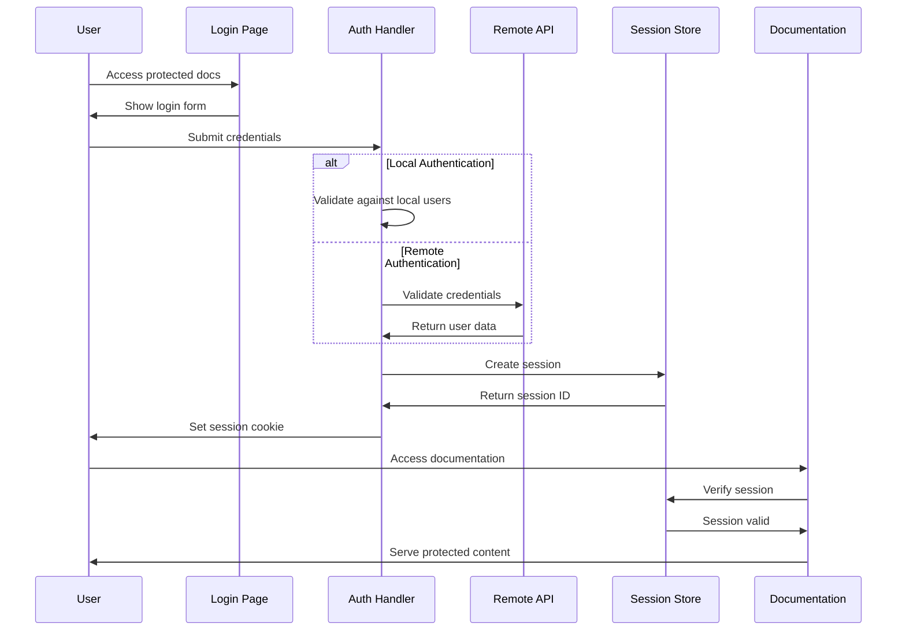

# 🔧 Authentication Developer Reference

Complete technical reference for APIDoc's authentication system including API specifications, security implementation details, and advanced customization options.

## 🏗️ Architecture Overview

### Authentication Flow


### System Components

#### 1. Authentication Middleware
```typescript
interface AuthMiddleware {
  // Core authentication methods
  validateCredentials(username: string, password: string): Promise<AuthResult>;
  createSession(user: User): Promise<Session>;
  validateSession(sessionId: string): Promise<Session | null>;
  destroySession(sessionId: string): Promise<void>;

  // Security methods
  checkRateLimit(ip: string): Promise<boolean>;
  logAuthAttempt(attempt: AuthAttempt): Promise<void>;
  sanitizeInput(input: string): string;
}
```

#### 2. Session Management
```typescript
interface SessionManager {
  create(user: User, options?: SessionOptions): Promise<Session>;
  get(sessionId: string): Promise<Session | null>;
  update(sessionId: string, data: Partial<SessionData>): Promise<void>;
  destroy(sessionId: string): Promise<void>;
  cleanup(): Promise<number>; // Returns number of expired sessions removed

  // Advanced methods
  regenerateId(sessionId: string): Promise<string>;
  touch(sessionId: string): Promise<void>;
  getActiveSessions(userId: string): Promise<Session[]>;
}
```

#### 3. User Provider Interface
```typescript
interface UserProvider {
  authenticate(credentials: Credentials): Promise<AuthResult>;
  getUser(userId: string): Promise<User | null>;
  validatePassword(password: string, hash: string): Promise<boolean>;
  hashPassword(password: string): Promise<string>;

  // Optional methods
  getUserPermissions?(userId: string): Promise<string[]>;
  updateLastLogin?(userId: string): Promise<void>;
  lockAccount?(userId: string, reason: string): Promise<void>;
}
```

## 🔐 Security Implementation

### Password Security
```typescript
// lib/security/password.ts
import bcrypt from 'bcrypt';
import zxcvbn from 'zxcvbn';

export class PasswordSecurity {
  private static readonly SALT_ROUNDS = 12;
  private static readonly MIN_STRENGTH = 3;

  static async hash(password: string): Promise<string> {
    // Validate password strength
    const strength = zxcvbn(password);
    if (strength.score < this.MIN_STRENGTH) {
      throw new Error(`Password too weak: ${strength.feedback.warning}`);
    }

    return bcrypt.hash(password, this.SALT_ROUNDS);
  }

  static async verify(password: string, hash: string): Promise<boolean> {
    return bcrypt.compare(password, hash);
  }

  static validateStrength(password: string): PasswordStrengthResult {
    const result = zxcvbn(password);

    return {
      score: result.score,
      feedback: result.feedback,
      crackTime: result.crack_times_display.offline_slow_hashing_1e4_per_second,
      isValid: result.score >= this.MIN_STRENGTH
    };
  }
}

interface PasswordStrengthResult {
  score: number;
  feedback: {
    warning: string;
    suggestions: string[];
  };
  crackTime: string;
  isValid: boolean;
}
```

### Session Security
```typescript
// lib/security/session.ts
import crypto from 'crypto';
import { promisify } from 'util';

export class SessionSecurity {
  private static readonly SESSION_ID_LENGTH = 32;
  private static readonly CSRF_TOKEN_LENGTH = 32;

  static generateSessionId(): string {
    return crypto.randomBytes(this.SESSION_ID_LENGTH).toString('hex');
  }

  static generateCSRFToken(): string {
    return crypto.randomBytes(this.CSRF_TOKEN_LENGTH).toString('hex');
  }

  static async encryptSessionData(data: any, secret: string): Promise<string> {
    const algorithm = 'aes-256-gcm';
    const iv = crypto.randomBytes(16);
    const cipher = crypto.createCipher(algorithm, secret);

    let encrypted = cipher.update(JSON.stringify(data), 'utf8', 'hex');
    encrypted += cipher.final('hex');

    const authTag = cipher.getAuthTag();

    return `${iv.toString('hex')}:${authTag.toString('hex')}:${encrypted}`;
  }

  static async decryptSessionData(encryptedData: string, secret: string): Promise<any> {
    const [ivHex, authTagHex, encrypted] = encryptedData.split(':');

    const algorithm = 'aes-256-gcm';
    const iv = Buffer.from(ivHex, 'hex');
    const authTag = Buffer.from(authTagHex, 'hex');
    const decipher = crypto.createDecipher(algorithm, secret);

    decipher.setAuthTag(authTag);

    let decrypted = decipher.update(encrypted, 'hex', 'utf8');
    decrypted += decipher.final('utf8');

    return JSON.parse(decrypted);
  }

  static validateSessionIntegrity(session: Session): boolean {
    // Check session expiration
    if (Date.now() > session.expiresAt) {
      return false;
    }

    // Check session fingerprint
    if (!this.validateFingerprint(session)) {
      return false;
    }

    // Check for session hijacking indicators
    if (this.detectHijacking(session)) {
      return false;
    }

    return true;
  }

  private static validateFingerprint(session: Session): boolean {
    // Implementation for device fingerprinting
    return true;
  }

  private static detectHijacking(session: Session): boolean {
    // Implementation for hijacking detection
    return false;
  }
}
```

### Rate Limiting
```typescript
// lib/security/rateLimit.ts
export class RateLimit {
  private attempts: Map<string, AttemptRecord[]> = new Map();
  private readonly maxAttempts: number;
  private readonly windowMs: number;
  private readonly lockoutDuration: number;

  constructor(options: RateLimitOptions) {
    this.maxAttempts = options.maxAttempts || 5;
    this.windowMs = options.windowMs || 15 * 60 * 1000; // 15 minutes
    this.lockoutDuration = options.lockoutDuration || 60 * 60 * 1000; // 1 hour
  }

  async checkLimit(identifier: string): Promise<RateLimitResult> {
    const now = Date.now();
    const attempts = this.getAttempts(identifier);

    // Clean old attempts
    const validAttempts = attempts.filter(
      attempt => now - attempt.timestamp < this.windowMs
    );

    // Check if locked out
    const lockoutEnd = this.getLockoutEnd(validAttempts);
    if (lockoutEnd && now < lockoutEnd) {
      return {
        allowed: false,
        remaining: 0,
        resetTime: lockoutEnd,
        lockoutEnd
      };
    }

    // Check rate limit
    if (validAttempts.length >= this.maxAttempts) {
      // Lock account
      validAttempts.push({
        timestamp: now,
        type: 'lockout'
      });

      return {
        allowed: false,
        remaining: 0,
        resetTime: now + this.lockoutDuration,
        lockoutEnd: now + this.lockoutDuration
      };
    }

    return {
      allowed: true,
      remaining: this.maxAttempts - validAttempts.length,
      resetTime: now + this.windowMs
    };
  }

  async recordAttempt(identifier: string, type: 'success' | 'failure'): Promise<void> {
    const attempts = this.getAttempts(identifier);

    attempts.push({
      timestamp: Date.now(),
      type
    });

    // Clear attempts on successful login
    if (type === 'success') {
      this.attempts.delete(identifier);
    } else {
      this.attempts.set(identifier, attempts);
    }
  }

  private getAttempts(identifier: string): AttemptRecord[] {
    return this.attempts.get(identifier) || [];
  }

  private getLockoutEnd(attempts: AttemptRecord[]): number | null {
    const lockoutAttempt = attempts.find(attempt => attempt.type === 'lockout');
    return lockoutAttempt ? lockoutAttempt.timestamp + this.lockoutDuration : null;
  }
}

interface AttemptRecord {
  timestamp: number;
  type: 'success' | 'failure' | 'lockout';
}

interface RateLimitOptions {
  maxAttempts?: number;
  windowMs?: number;
  lockoutDuration?: number;
}

interface RateLimitResult {
  allowed: boolean;
  remaining: number;
  resetTime: number;
  lockoutEnd?: number;
}
```

## 🔌 Custom User Providers

### Database User Provider
```typescript
// providers/DatabaseUserProvider.ts
import { Pool } from 'pg';
import { UserProvider, User, Credentials, AuthResult } from '../types';
import { PasswordSecurity } from '../security/password';

export class DatabaseUserProvider implements UserProvider {
  private db: Pool;

  constructor(connectionString: string) {
    this.db = new Pool({ connectionString });
  }

  async authenticate(credentials: Credentials): Promise<AuthResult> {
    try {
      const query = `
        SELECT id, username, password_hash, role, email, active, last_login,
               failed_attempts, locked_until
        FROM users
        WHERE username = $1 OR email = $1
      `;

      const result = await this.db.query(query, [credentials.username]);
      const user = result.rows[0];

      if (!user) {
        return { success: false, error: 'Invalid credentials' };
      }

      if (!user.active) {
        return { success: false, error: 'Account disabled' };
      }

      if (user.locked_until && new Date() < user.locked_until) {
        return { success: false, error: 'Account temporarily locked' };
      }

      const passwordValid = await PasswordSecurity.verify(
        credentials.password,
        user.password_hash
      );

      if (!passwordValid) {
        await this.recordFailedAttempt(user.id);
        return { success: false, error: 'Invalid credentials' };
      }

      await this.recordSuccessfulLogin(user.id);

      return {
        success: true,
        user: {
          id: user.id,
          username: user.username,
          email: user.email,
          role: user.role,
          permissions: await this.getUserPermissions(user.id)
        }
      };

    } catch (error) {
      console.error('Authentication error:', error);
      return { success: false, error: 'Authentication failed' };
    }
  }

  async getUser(userId: string): Promise<User | null> {
    try {
      const query = `
        SELECT id, username, email, role, active
        FROM users
        WHERE id = $1 AND active = true
      `;

      const result = await this.db.query(query, [userId]);
      const user = result.rows[0];

      if (!user) return null;

      return {
        id: user.id,
        username: user.username,
        email: user.email,
        role: user.role,
        permissions: await this.getUserPermissions(user.id)
      };

    } catch (error) {
      console.error('Get user error:', error);
      return null;
    }
  }

  async getUserPermissions(userId: string): Promise<string[]> {
    try {
      const query = `
        SELECT p.name
        FROM permissions p
        JOIN role_permissions rp ON p.id = rp.permission_id
        JOIN users u ON u.role = rp.role_name
        WHERE u.id = $1
        UNION
        SELECT p.name
        FROM permissions p
        JOIN user_permissions up ON p.id = up.permission_id
        WHERE up.user_id = $1
      `;

      const result = await this.db.query(query, [userId]);
      return result.rows.map(row => row.name);

    } catch (error) {
      console.error('Get permissions error:', error);
      return [];
    }
  }

  async validatePassword(password: string, hash: string): Promise<boolean> {
    return PasswordSecurity.verify(password, hash);
  }

  async hashPassword(password: string): Promise<string> {
    return PasswordSecurity.hash(password);
  }

  private async recordFailedAttempt(userId: string): Promise<void> {
    const query = `
      UPDATE users
      SET failed_attempts = COALESCE(failed_attempts, 0) + 1,
          locked_until = CASE
            WHEN COALESCE(failed_attempts, 0) >= 4
            THEN NOW() + INTERVAL '1 hour'
            ELSE locked_until
          END
      WHERE id = $1
    `;

    await this.db.query(query, [userId]);
  }

  private async recordSuccessfulLogin(userId: string): Promise<void> {
    const query = `
      UPDATE users
      SET last_login = NOW(),
          failed_attempts = 0,
          locked_until = NULL
      WHERE id = $1
    `;

    await this.db.query(query, [userId]);
  }
}
```

### LDAP User Provider
```typescript
// providers/LDAPUserProvider.ts
import ldap from 'ldapjs';
import { UserProvider, User, Credentials, AuthResult } from '../types';

export class LDAPUserProvider implements UserProvider {
  private ldapUrl: string;
  private baseDN: string;
  private bindDN: string;
  private bindPassword: string;

  constructor(config: LDAPConfig) {
    this.ldapUrl = config.url;
    this.baseDN = config.baseDN;
    this.bindDN = config.bindDN;
    this.bindPassword = config.bindPassword;
  }

  async authenticate(credentials: Credentials): Promise<AuthResult> {
    return new Promise((resolve) => {
      const client = ldap.createClient({ url: this.ldapUrl });

      // First, bind with service account
      client.bind(this.bindDN, this.bindPassword, (bindErr) => {
        if (bindErr) {
          client.destroy();
          resolve({ success: false, error: 'LDAP bind failed' });
          return;
        }

        // Search for user
        const searchFilter = `(&(objectClass=person)(|(uid=${credentials.username})(mail=${credentials.username})))`;
        const searchOptions = {
          scope: 'sub',
          filter: searchFilter,
          attributes: ['uid', 'mail', 'cn', 'memberOf']
        };

        client.search(this.baseDN, searchOptions, (searchErr, searchRes) => {
          if (searchErr) {
            client.destroy();
            resolve({ success: false, error: 'LDAP search failed' });
            return;
          }

          let userDN: string | null = null;
          let userData: any = null;

          searchRes.on('searchEntry', (entry) => {
            userDN = entry.dn.toString();
            userData = entry.object;
          });

          searchRes.on('end', () => {
            if (!userDN || !userData) {
              client.destroy();
              resolve({ success: false, error: 'User not found' });
              return;
            }

            // Try to bind with user credentials
            const userClient = ldap.createClient({ url: this.ldapUrl });

            userClient.bind(userDN, credentials.password, (userBindErr) => {
              userClient.destroy();
              client.destroy();

              if (userBindErr) {
                resolve({ success: false, error: 'Invalid credentials' });
                return;
              }

              // Extract user information
              const user: User = {
                id: userData.uid,
                username: userData.uid,
                email: userData.mail,
                role: this.extractRole(userData.memberOf),
                permissions: this.extractPermissions(userData.memberOf)
              };

              resolve({ success: true, user });
            });
          });

          searchRes.on('error', (err) => {
            client.destroy();
            resolve({ success: false, error: 'LDAP search error' });
          });
        });
      });
    });
  }

  async getUser(userId: string): Promise<User | null> {
    // Implementation for getting user by ID from LDAP
    return null;
  }

  async validatePassword(password: string, hash: string): Promise<boolean> {
    // LDAP handles password validation during bind
    throw new Error('LDAP provider does not support hash validation');
  }

  async hashPassword(password: string): Promise<string> {
    // LDAP handles password hashing
    throw new Error('LDAP provider does not support password hashing');
  }

  private extractRole(memberOf: string | string[]): string {
    const groups = Array.isArray(memberOf) ? memberOf : [memberOf];

    // Map LDAP groups to roles
    if (groups.some(group => group.includes('CN=Administrators'))) {
      return 'admin';
    } else if (groups.some(group => group.includes('CN=Developers'))) {
      return 'developer';
    } else {
      return 'user';
    }
  }

  private extractPermissions(memberOf: string | string[]): string[] {
    const groups = Array.isArray(memberOf) ? memberOf : [memberOf];
    const permissions: string[] = [];

    // Map LDAP groups to permissions
    groups.forEach(group => {
      if (group.includes('CN=API-Read')) {
        permissions.push('read');
      }
      if (group.includes('CN=API-Write')) {
        permissions.push('write');
      }
      if (group.includes('CN=API-Admin')) {
        permissions.push('admin');
      }
    });

    return permissions;
  }
}

interface LDAPConfig {
  url: string;
  baseDN: string;
  bindDN: string;
  bindPassword: string;
}
```

## 🔧 Advanced Configuration

### Environment-based Configuration
```typescript
// config/auth.config.ts
import { AuthConfig } from '../types';

export function createAuthConfig(): AuthConfig {
  const env = process.env.NODE_ENV || 'development';

  const baseConfig: AuthConfig = {
    enabled: process.env.AUTH_ENABLED === 'true',
    type: (process.env.AUTH_TYPE as 'local' | 'remote') || 'local',
    session: {
      secret: process.env.SESSION_SECRET || 'default-secret-change-this',
      timeout: parseInt(process.env.SESSION_TIMEOUT || '3600'),
      secure: process.env.NODE_ENV === 'production',
      sameSite: process.env.NODE_ENV === 'production' ? 'strict' : 'lax',
      httpOnly: true,
      domain: process.env.SESSION_DOMAIN
    },
    security: {
      maxAttempts: parseInt(process.env.MAX_LOGIN_ATTEMPTS || '5'),
      lockoutDuration: parseInt(process.env.LOCKOUT_DURATION || '900'),
      requireHttps: process.env.REQUIRE_HTTPS === 'true',
      csrfProtection: process.env.CSRF_PROTECTION === 'true',
      sessionRegeneration: true
    },
    audit: {
      enabled: process.env.AUDIT_ENABLED === 'true',
      logFile: process.env.AUDIT_LOG_FILE || './logs/auth.log',
      includeIP: true,
      includeUserAgent: true,
      logSuccessfulLogins: true,
      logFailedAttempts: true
    }
  };

  // Environment-specific overrides
  switch (env) {
    case 'development':
      return {
        ...baseConfig,
        security: {
          ...baseConfig.security,
          maxAttempts: 10,
          requireHttps: false
        }
      };

    case 'staging':
      return {
        ...baseConfig,
        session: {
          ...baseConfig.session,
          timeout: 7200 // 2 hours
        }
      };

    case 'production':
      return {
        ...baseConfig,
        security: {
          ...baseConfig.security,
          maxAttempts: 3,
          requireHttps: true,
          csrfProtection: true
        },
        audit: {
          ...baseConfig.audit,
          enabled: true
        }
      };

    default:
      return baseConfig;
  }
}
```

### Dynamic User Provider Loading
```typescript
// lib/auth/providerFactory.ts
import { UserProvider } from '../types';
import { DatabaseUserProvider } from '../providers/DatabaseUserProvider';
import { LDAPUserProvider } from '../providers/LDAPUserProvider';
import { LocalFileUserProvider } from '../providers/LocalFileUserProvider';
import { RemoteAPIUserProvider } from '../providers/RemoteAPIUserProvider';

export class UserProviderFactory {
  static create(config: AuthConfig): UserProvider {
    switch (config.type) {
      case 'local':
        if (config.database) {
          return new DatabaseUserProvider(config.database.connectionString);
        } else {
          return new LocalFileUserProvider(config.users || []);
        }

      case 'ldap':
        return new LDAPUserProvider({
          url: config.ldap!.url,
          baseDN: config.ldap!.baseDN,
          bindDN: config.ldap!.bindDN,
          bindPassword: config.ldap!.bindPassword
        });

      case 'remote':
        return new RemoteAPIUserProvider({
          endpoint: config.endpoint!,
          headers: config.headers || {},
          timeout: config.timeout || 5000
        });

      default:
        throw new Error(`Unsupported auth type: ${config.type}`);
    }
  }
}
```

## 🔍 Monitoring and Debugging

### Authentication Logger
```typescript
// lib/auth/logger.ts
import winston from 'winston';
import { AuthAttempt, Session, User } from '../types';

export class AuthLogger {
  private logger: winston.Logger;

  constructor(config: AuditConfig) {
    this.logger = winston.createLogger({
      level: 'info',
      format: winston.format.combine(
        winston.format.timestamp(),
        winston.format.errors({ stack: true }),
        winston.format.json()
      ),
      transports: [
        new winston.transports.File({
          filename: config.logFile,
          maxsize: 50 * 1024 * 1024, // 50MB
          maxFiles: 10
        }),
        new winston.transports.Console({
          format: winston.format.simple()
        })
      ]
    });
  }

  logLogin(user: User, request: AuthRequest): void {
    this.logger.info('User login', {
      event: 'login',
      userId: user.id,
      username: user.username,
      role: user.role,
      ip: request.ip,
      userAgent: request.userAgent,
      timestamp: new Date().toISOString()
    });
  }

  logFailedAttempt(attempt: AuthAttempt, request: AuthRequest): void {
    this.logger.warn('Failed login attempt', {
      event: 'login_failed',
      username: attempt.username,
      reason: attempt.error,
      ip: request.ip,
      userAgent: request.userAgent,
      timestamp: new Date().toISOString()
    });
  }

  logLogout(user: User, request: AuthRequest): void {
    this.logger.info('User logout', {
      event: 'logout',
      userId: user.id,
      username: user.username,
      ip: request.ip,
      timestamp: new Date().toISOString()
    });
  }

  logSessionExpired(sessionId: string): void {
    this.logger.info('Session expired', {
      event: 'session_expired',
      sessionId: sessionId.substring(0, 8) + '...',
      timestamp: new Date().toISOString()
    });
  }

  logSecurityEvent(event: string, details: any): void {
    this.logger.error('Security event', {
      event: 'security_alert',
      type: event,
      details,
      timestamp: new Date().toISOString()
    });
  }
}

interface AuthRequest {
  ip: string;
  userAgent: string;
  sessionId?: string;
}

interface AuditConfig {
  logFile: string;
  includeIP: boolean;
  includeUserAgent: boolean;
  logSuccessfulLogins: boolean;
  logFailedAttempts: boolean;
}
```

### Health Check Endpoint
```typescript
// lib/auth/healthCheck.ts
export class AuthHealthCheck {
  constructor(
    private userProvider: UserProvider,
    private sessionManager: SessionManager,
    private rateLimit: RateLimit
  ) {}

  async checkHealth(): Promise<HealthCheckResult> {
    const checks: HealthCheck[] = [];

    // Check user provider
    try {
      await this.userProvider.getUser('health-check-user');
      checks.push({
        name: 'user_provider',
        status: 'healthy',
        responseTime: Date.now()
      });
    } catch (error) {
      checks.push({
        name: 'user_provider',
        status: 'unhealthy',
        error: error.message
      });
    }

    // Check session store
    try {
      await this.sessionManager.get('health-check-session');
      checks.push({
        name: 'session_store',
        status: 'healthy',
        responseTime: Date.now()
      });
    } catch (error) {
      checks.push({
        name: 'session_store',
        status: 'unhealthy',
        error: error.message
      });
    }

    // Check rate limiting
    try {
      await this.rateLimit.checkLimit('health-check-ip');
      checks.push({
        name: 'rate_limiter',
        status: 'healthy',
        responseTime: Date.now()
      });
    } catch (error) {
      checks.push({
        name: 'rate_limiter',
        status: 'unhealthy',
        error: error.message
      });
    }

    const overall = checks.every(check => check.status === 'healthy')
      ? 'healthy' : 'unhealthy';

    return {
      status: overall,
      timestamp: new Date().toISOString(),
      checks
    };
  }
}

interface HealthCheck {
  name: string;
  status: 'healthy' | 'unhealthy';
  responseTime?: number;
  error?: string;
}

interface HealthCheckResult {
  status: 'healthy' | 'unhealthy';
  timestamp: string;
  checks: HealthCheck[];
}
```

## 🧪 Testing Framework

### Authentication Test Suite
```typescript
// tests/auth.test.ts
import { describe, it, expect, beforeEach, afterEach } from '@jest/globals';
import request from 'supertest';
import { AuthTestHelper } from './helpers/AuthTestHelper';
import { createTestApp } from './helpers/testApp';

describe('Authentication System', () => {
  let app: any;
  let authHelper: AuthTestHelper;

  beforeEach(async () => {
    app = createTestApp();
    authHelper = new AuthTestHelper();
    await authHelper.setup();
  });

  afterEach(async () => {
    await authHelper.cleanup();
  });

  describe('Login Flow', () => {
    it('should authenticate valid user', async () => {
      const credentials = {
        username: 'testuser',
        password: 'testpass123'
      };

      const response = await request(app)
        .post('/auth/login')
        .send(credentials)
        .expect(200);

      expect(response.body.success).toBe(true);
      expect(response.body.user.username).toBe(credentials.username);
      expect(response.headers['set-cookie']).toBeDefined();
    });

    it('should reject invalid credentials', async () => {
      const credentials = {
        username: 'testuser',
        password: 'wrongpassword'
      };

      const response = await request(app)
        .post('/auth/login')
        .send(credentials)
        .expect(401);

      expect(response.body.success).toBe(false);
      expect(response.body.error).toBe('Invalid credentials');
    });

    it('should enforce rate limiting', async () => {
      const credentials = {
        username: 'testuser',
        password: 'wrongpassword'
      };

      // Make multiple failed attempts
      for (let i = 0; i < 5; i++) {
        await request(app)
          .post('/auth/login')
          .send(credentials)
          .expect(401);
      }

      // Next attempt should be rate limited
      const response = await request(app)
        .post('/auth/login')
        .send(credentials)
        .expect(429);

      expect(response.body.error).toContain('rate limit');
    });
  });

  describe('Session Management', () => {
    it('should maintain session across requests', async () => {
      const { sessionCookie } = await authHelper.loginUser('testuser');

      const response = await request(app)
        .get('/api/protected')
        .set('Cookie', sessionCookie)
        .expect(200);

      expect(response.body.authenticated).toBe(true);
    });

    it('should reject expired sessions', async () => {
      const { sessionCookie } = await authHelper.loginUser('testuser');

      // Fast-forward time to expire session
      await authHelper.expireSession();

      const response = await request(app)
        .get('/api/protected')
        .set('Cookie', sessionCookie)
        .expect(401);

      expect(response.body.error).toContain('session');
    });

    it('should logout successfully', async () => {
      const { sessionCookie } = await authHelper.loginUser('testuser');

      // Logout
      await request(app)
        .post('/auth/logout')
        .set('Cookie', sessionCookie)
        .expect(200);

      // Verify session is invalid
      const response = await request(app)
        .get('/api/protected')
        .set('Cookie', sessionCookie)
        .expect(401);
    });
  });

  describe('Security Features', () => {
    it('should prevent CSRF attacks', async () => {
      const { sessionCookie } = await authHelper.loginUser('testuser');

      const response = await request(app)
        .post('/api/dangerous-action')
        .set('Cookie', sessionCookie)
        // Missing CSRF token
        .expect(403);

      expect(response.body.error).toContain('CSRF');
    });

    it('should detect session hijacking', async () => {
      const { sessionCookie } = await authHelper.loginUser('testuser');

      // Simulate request from different IP/User-Agent
      const response = await request(app)
        .get('/api/protected')
        .set('Cookie', sessionCookie)
        .set('X-Forwarded-For', '192.168.1.100')
        .set('User-Agent', 'Different Browser')
        .expect(401);

      expect(response.body.error).toContain('security');
    });
  });
});
```

## 📋 API Reference

### Authentication Endpoints

#### POST /auth/login
```typescript
interface LoginRequest {
  username: string;
  password: string;
  rememberMe?: boolean;
}

interface LoginResponse {
  success: boolean;
  user?: User;
  token?: string;
  expiresAt?: string;
  error?: string;
}
```

#### POST /auth/logout
```typescript
interface LogoutResponse {
  success: boolean;
  message: string;
}
```

#### GET /auth/status
```typescript
interface StatusResponse {
  authenticated: boolean;
  user?: User;
  expiresAt?: string;
  permissions?: string[];
}
```

#### GET /auth/health
```typescript
interface HealthResponse {
  status: 'healthy' | 'unhealthy';
  timestamp: string;
  checks: HealthCheck[];
}
```

## 🔒 Security Best Practices

### Production Deployment Checklist

- ✅ Use strong session secrets (32+ random characters)
- ✅ Enable HTTPS in production
- ✅ Set secure session cookies
- ✅ Implement CSRF protection
- ✅ Configure rate limiting
- ✅ Enable audit logging
- ✅ Use secure password hashing
- ✅ Implement session timeout
- ✅ Monitor for security events
- ✅ Regular security updates

### Environment Variables
```bash
# Required
SESSION_SECRET=your-super-secure-session-secret-32-chars-minimum
AUTH_TYPE=remote
AUTH_ENDPOINT=https://your-auth-api.com/validate

# Optional Security
REQUIRE_HTTPS=true
CSRF_PROTECTION=true
MAX_LOGIN_ATTEMPTS=3
LOCKOUT_DURATION=900
SESSION_TIMEOUT=3600

# Audit
AUDIT_ENABLED=true
AUDIT_LOG_FILE=/var/log/apidoc-auth.log
```

This comprehensive developer reference provides everything needed to implement, customize, and maintain APIDoc's authentication system at an enterprise level.