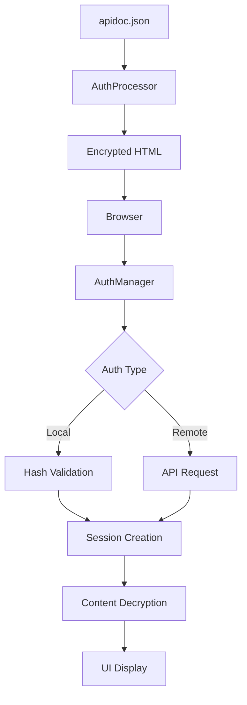

# 🔐 APIDoc 4.0 - Sistema de Autenticación Dual

## 📋 Tabla de Contenidos

1. [Introducción](#introducción)
2. [Características](#características)
3. [Instalación y Configuración](#instalación-y-configuración)
4. [Tipos de Autenticación](#tipos-de-autenticación)
5. [Configuración Avanzada](#configuración-avanzada)
6. [Uso y Ejemplos](#uso-y-ejemplos)
7. [API y Desarrollo](#api-y-desarrollo)
8. [Seguridad](#seguridad)
9. [Solución de Problemas](#solución-de-problemas)
10. [Referencia Técnica](#referencia-técnica)

---

## Introducción

El **Sistema de Autenticación Dual** de APIDoc 4.0 permite proteger la documentación de API mediante dos métodos de autenticación que pueden funcionar de forma independiente o complementaria:

- **🏠 Autenticación Local**: Usuarios predefinidos en la configuración
- **🌐 Autenticación Remota**: Integración con API externa de autenticación

### ✨ Características Principales

- ✅ **Dual Authentication**: Local y remota en el mismo sistema
- ✅ **Content Protection**: Encriptación AES-256 del contenido sensible
- ✅ **Session Management**: Gestión de sesiones persistentes con localStorage
- ✅ **Responsive UI**: Interfaz adaptativa con soporte dark/light mode
- ✅ **Zero Dependencies**: Sin dependencias externas adicionales
- ✅ **Production Ready**: Listo para uso en producción

---

## Instalación y Configuración

### Paso 1: Configuración Básica

Edita el archivo `apidoc.json` en tu proyecto y agrega la sección `login`:

```json
{
  "name": "Mi API Documentation",
  "version": "1.0.0",
  "description": "Documentación de mi API",
  "login": {
    "active": true,
    "admited": [
      {
        "email": "admin@miempresa.com",
        "password": "mi_password_seguro"
      },
      {
        "email": "usuario@miempresa.com",
        "password": "otro_password"
      }
    ],
    "urlAuth": "https://auth.miempresa.com/api/login",
    "value_form": {
      "email": "email",
      "password": "password"
    },
    "response_success": 200,
    "response_error": 401
  }
}
```

### Paso 2: Generación

Ejecuta APIDoc normalmente:

```bash
# Instalar APIDoc 4.0
npm install -g @hrefcl/apidoc

# Generar documentación con autenticación
apidoc -i src/ -o docs/
```

### Paso 3: Despliegue

El sistema funciona con cualquier servidor web estático:

```bash
# Desarrollo
npx serve docs/ -p 8080

# Producción con Nginx
# Simplemente coloca los archivos en tu directorio web
```

---

## Tipos de Autenticación

### 🏠 Autenticación Local

Los usuarios se definen directamente en `apidoc.json`. Las contraseñas se hashean automáticamente durante la generación.

**Configuración:**
```json
{
  "login": {
    "active": true,
    "admited": [
      {
        "email": "usuario@ejemplo.com",
        "password": "password123"
      }
    ]
  }
}
```

**Ventajas:**
- ✅ Simple de configurar
- ✅ No requiere servidor de autenticación
- ✅ Funciona completamente offline
- ✅ Ideal para equipos pequeños

**Desventajas:**
- ⚠️ Usuarios fijos en tiempo de compilación
- ⚠️ Cambios requieren regenerar documentación

### 🌐 Autenticación Remota

Integración con tu sistema de autenticación existente mediante API REST.

**Configuración:**
```json
{
  "login": {
    "active": true,
    "urlAuth": "https://api.miempresa.com/auth/login",
    "value_form": {
      "email": "username",
      "password": "pass"
    },
    "response_success": 200,
    "response_error": 401
  }
}
```

**Ventajas:**
- ✅ Integración con sistemas existentes
- ✅ Usuarios dinámicos
- ✅ Gestión centralizada de credenciales
- ✅ Escalable para grandes equipos

**API Requerida:**

Tu endpoint debe recibir POST con:
```json
{
  "username": "usuario@ejemplo.com",
  "pass": "password123"
}
```

Y responder:
- **Éxito (200)**: Cualquier respuesta JSON
- **Error (401/400)**: Credenciales inválidas

### 🔗 Autenticación Híbrida

Puedes combinar ambos métodos. El sistema intentará primero la autenticación local, y luego la remota:

```json
{
  "login": {
    "active": true,
    "admited": [
      {
        "email": "admin@local.com",
        "password": "admin123"
      }
    ],
    "urlAuth": "https://api.miempresa.com/auth/login",
    "value_form": {
      "email": "email",
      "password": "password"
    },
    "response_success": 200,
    "response_error": 401
  }
}
```

---

## Configuración Avanzada

### Protección de Contenido

El sistema protege automáticamente estas secciones:

- **API Endpoints** (`sections`)
- **Header Content** (`header`)
- **Footer Content** (`footer`)
- **Project Information** (`project`)

### Personalización de Campos

Para APIs con nombres de campo diferentes:

```json
{
  "login": {
    "value_form": {
      "email": "user_email",      // Campo email en tu API
      "password": "user_password" // Campo password en tu API
    }
  }
}
```

### Códigos de Respuesta Personalizados

```json
{
  "login": {
    "response_success": 200,  // Código de éxito
    "response_error": 403     // Código de error
  }
}
```

### Configuración de Seguridad

```json
{
  "login": {
    "active": true,
    "sessionTimeout": 3600,     // Timeout en segundos (por defecto: 1 hora)
    "encryptionStrength": 256,  // AES-256 (no modificar)
    "hashIterations": 10000     // Iteraciones PBKDF2 (no modificar)
  }
}
```

---

## Uso y Ejemplos

### Ejemplo 1: Empresa Pequeña (Local)

```json
{
  "name": "API Interna - MiStartup",
  "version": "2.1.0",
  "login": {
    "active": true,
    "admited": [
      {
        "email": "ceo@mistartup.com",
        "password": "super_secreto_2024"
      },
      {
        "email": "dev@mistartup.com",
        "password": "dev_password"
      },
      {
        "email": "qa@mistartup.com",
        "password": "testing123"
      }
    ]
  }
}
```

### Ejemplo 2: Empresa con SSO

```json
{
  "name": "API Corporativa",
  "version": "1.0.0",
  "login": {
    "active": true,
    "urlAuth": "https://sso.miempresa.com/oauth/token",
    "value_form": {
      "email": "username",
      "password": "password"
    },
    "response_success": 200,
    "response_error": 401
  }
}
```

### Ejemplo 3: Configuración Híbrida

```json
{
  "name": "API con Acceso Dual",
  "version": "3.2.1",
  "login": {
    "active": true,
    "admited": [
      {
        "email": "emergency@empresa.com",
        "password": "emergency_access_2024"
      }
    ],
    "urlAuth": "https://auth.empresa.com/api/login",
    "value_form": {
      "email": "email",
      "password": "password"
    },
    "response_success": 200,
    "response_error": 400
  }
}
```

---

## API y Desarrollo

### Estructura de Archivos

```
mi-proyecto/
├── apidoc.json              # Configuración principal
├── src/                     # Tu código fuente con comentarios @api
├── docs/                    # Documentación generada
│   ├── index.html          # Página principal con autenticación
│   ├── assets/
│   │   ├── main.bundle.js  # Bundle con AuthManager
│   │   └── main.bundle.css # Estilos con tema oscuro/claro
│   └── test-workflow.html  # Página de pruebas
```

### API del AuthManager

```typescript
// Instancia global disponible en el navegador
window.authManager: AuthManager

// Métodos principales
authManager.isAuthenticated(): boolean
authManager.login(email: string, password: string): Promise<{success: boolean, message: string}>
authManager.logout(): void
authManager.getSessionInfo(): AuthSession | null
```

### Eventos de Autenticación

```javascript
// Escuchar eventos de login
document.addEventListener('apidoc:login:success', (event) => {
  console.log('Usuario autenticado:', event.detail);
});

document.addEventListener('apidoc:login:error', (event) => {
  console.log('Error de login:', event.detail);
});

document.addEventListener('apidoc:logout', (event) => {
  console.log('Usuario desconectado');
});
```

### Integración con Scripts Personalizados

```html
<script>
document.addEventListener('DOMContentLoaded', function() {
  // Esperar a que el AuthManager esté disponible
  if (window.authManager && window.authManager.isAuthenticated()) {
    console.log('Usuario ya autenticado');
    // Tu código personalizado aquí
  }
});
</script>
```

---

## Seguridad {#seguridad}

### 🔒 Medidas Implementadas

1. **Hash de Contraseñas**: SHA-256 con salt personalizado
2. **Encriptación AES-256**: Para protección de contenido
3. **PBKDF2**: 10,000 iteraciones para derivación de claves
4. **Session Management**: Tokens con expiración
5. **HTTPS Enforcement**: Recomendado para producción

### 🛡️ Mejores Prácticas

**Para Autenticación Local:**
```json
{
  "admited": [
    {
      "email": "admin@empresa.com",
      "password": "MinimoCambiarEstaContraseñaEnProduccion2024!"
    }
  ]
}
```

**Para Autenticación Remota:**
- ✅ Usar HTTPS siempre
- ✅ Implementar rate limiting en tu API
- ✅ Validar tokens JWT si es aplicable
- ✅ Configurar CORS correctamente

**Configuración de Servidor Web:**

**Nginx:**
```nginx
server {
    listen 443 ssl;
    server_name docs.miapi.com;

    ssl_certificate /path/to/cert.pem;
    ssl_certificate_key /path/to/key.pem;

    location / {
        root /var/www/apidoc;
        index index.html;
        try_files $uri $uri/ =404;

        # Headers de seguridad
        add_header X-Frame-Options DENY;
        add_header X-Content-Type-Options nosniff;
        add_header X-XSS-Protection "1; mode=block";
    }
}
```

**Apache (.htaccess):**
```apache
# Seguridad básica
Header always set X-Frame-Options DENY
Header always set X-Content-Type-Options nosniff
Header always set X-XSS-Protection "1; mode=block"

# Forzar HTTPS
RewriteEngine On
RewriteCond %{HTTPS} off
RewriteRule ^(.*)$ https://%{HTTP_HOST}%{REQUEST_URI} [L,R=301]
```

### ⚠️ Consideraciones de Seguridad

**Limitaciones de la Autenticación Local:**
- Las contraseñas hasheadas están en el HTML generado
- Aunque están hasheadas, no es recomendable para datos altamente sensibles
- Para máxima seguridad, usar solo autenticación remota

**Recomendaciones:**
- 🔐 Para datos públicos o semi-públicos: Autenticación local OK
- 🏢 Para datos corporativos internos: Autenticación remota recomendada
- 🚨 Para datos altamente confidenciales: Considerar soluciones adicionales

---

## Solución de Problemas

### ❌ "Login form doesn't appear"

**Causa**: Timing de inicialización

**Solución:**
```javascript
// Verificar en consola del navegador
console.log('AuthManager available:', !!window.AuthManager);
console.log('Login config:', window.LOGIN_CONFIG);
```

Si `AuthManager` no está disponible:
1. Verificar que el bundle se generó correctamente
2. Revisar errores en consola del navegador
3. Regenerar con `npm run build:example`

### ❌ "Authentication failed" con credenciales correctas

**Causa**: Problema de hash o configuración

**Solución:**
```bash
# Usar el script de validación
cd tmp/apidoc-output
node test-credentials.js
```

### ❌ "Templates not found"

**Causa**: DOM destruido prematuramente

**Verificación:**
```javascript
// En consola del navegador
document.getElementById('template-header') // Debe existir
document.getElementById('sidenav') // Debe existir
```

**Solución**: El sistema ya incluye la corrección automática

### ❌ Autenticación remota falla

**Debugging:**
```javascript
// Verificar configuración
console.log('Remote config:', {
  url: window.LOGIN_CONFIG?.urlAuth,
  fields: window.LOGIN_CONFIG?.value_form
});
```

**Verificar tu API:**
```bash
# Probar manualmente
curl -X POST https://tu-api.com/auth/login \
  -H "Content-Type: application/json" \
  -d '{"email":"test@test.com","password":"test123"}'
```

### 🔧 Herramientas de Debug

**Scripts incluidos:**
```bash
# Validación completa del sistema
node validate-system.js

# Verificar credenciales
node test-credentials.js

# Guía completa de testing
node final-test-guide.js
```

**Debug en navegador:**
```javascript
// Estado de autenticación
window.authManager?.getSessionInfo()

// Configuración cargada
window.LOGIN_CONFIG

// Verificar templates
Object.keys(Handlebars.templates || {})
```

---

## Referencia Técnica

### Arquitectura del Sistema



### Flujo de Autenticación

1. **Inicialización**:
   - Página carga con templates
   - AuthManager se inicializa después de 1 segundo
   - Login overlay aparece si requerido

2. **Proceso de Login**:
   - Usuario ingresa credenciales
   - Sistema intenta autenticación local primero
   - Si falla, intenta autenticación remota
   - Crea sesión si es exitoso

3. **Post-Autenticación**:
   - Overlay de login se remueve
   - Contenido principal se hace visible
   - Sesión se persiste en localStorage

### Configuración Completa

```typescript
interface LoginConfig {
  active: boolean;                              // Activar/desactivar autenticación
  admited?: Array<{                            // Usuarios locales
    email: string;
    password: string;
  }>;
  urlAuth?: string;                            // URL de autenticación remota
  value_form?: {                               // Mapeo de campos
    email: string;
    password: string;
  };
  response_success?: number;                   // Código HTTP de éxito
  response_error?: number;                     // Código HTTP de error
}

interface AuthSession {
  email: string;                               // Email del usuario
  authenticated: boolean;                      // Estado de autenticación
  expires: number;                            // Timestamp de expiración
  method: 'local' | 'remote';                 // Método usado
}
```

### Archivos del Sistema

| Archivo | Propósito | Ubicación |
|---------|-----------|-----------|
| `lib/core/auth-processor.ts` | Procesador principal de autenticación | Backend/Build |
| `template/src/components/auth.ts` | Manager de autenticación cliente | Frontend/Bundle |
| `template/src/components/content-protection.ts` | Sistema de protección | Frontend/Bundle |
| `template/src/main.ts` | Integración principal | Frontend/Bundle |
| `template/index.html` | Template con configuración | Template |
| `lib/writer.ts` | Integración con proceso de build | Backend/Build |

### Comandos de Desarrollo

```bash
# Desarrollo completo
npm run dev:template          # Compilar y servir con recarga

# Testing
npm run build:example         # Generar documentación de ejemplo
npm run test                  # Ejecutar tests
npm run typecheck            # Verificación TypeScript

# Producción
npm run build:clean          # Build limpio para producción
npm run prepublishOnly       # Preparar para publicación
```

### Personalización Avanzada

**CSS Custom Properties:**
```css
:root {
  --auth-overlay-bg: rgba(0, 0, 0, 0.8);
  --auth-form-bg: white;
  --auth-input-border: #d1d5db;
  --auth-button-bg: #3b82f6;
}

[data-theme="dark"] {
  --auth-form-bg: #1f2937;
  --auth-input-border: #374151;
}
```

**JavaScript Hooks:**
```javascript
// Personalizar el proceso de login
window.addEventListener('apidoc:auth:init', (event) => {
  // Tu código personalizado de inicialización
});

window.addEventListener('apidoc:auth:success', (event) => {
  // Tu código post-autenticación
  console.log('Usuario:', event.detail.user);
});
```

---

## 📚 Recursos Adicionales

### Enlaces Útiles

- **Repository**: https://github.com/hrefcl/apidoc
- **NPM Package**: https://www.npmjs.com/package/@hrefcl/apidoc
- **Documentation**: https://apidocjs.com
- **Issues**: https://github.com/hrefcl/apidoc/issues

### Ejemplos Completos

Disponibles en el repositorio:
- `example/apidoc.json` - Configuración completa
- `tmp/apidoc-output/` - Documentación generada
- `test-*.js` - Scripts de testing

### Contribuir

Para contribuir al desarrollo del sistema de autenticación:

1. Fork del repositorio
2. Crear rama para tu feature: `git checkout -b feature/auth-mejora`
3. Commit tus cambios: `git commit -m 'Add: nueva funcionalidad'`
4. Push a la rama: `git push origin feature/auth-mejora`
5. Crear Pull Request

### Licencia

MIT License - Ver archivo LICENSE para detalles completos.

---

## 🎉 Conclusión

El Sistema de Autenticación Dual de APIDoc 4.0 proporciona una solución robusta y flexible para proteger documentación de API. Con soporte para autenticación local y remota, encriptación de contenido y una interfaz moderna, es ideal tanto para equipos pequeños como para grandes organizaciones.

**¡Tu documentación API ahora está protegida y lista para producción!** 🚀

---

*Documentación actualizada para APIDoc 4.0 - Última actualización: $(date)*